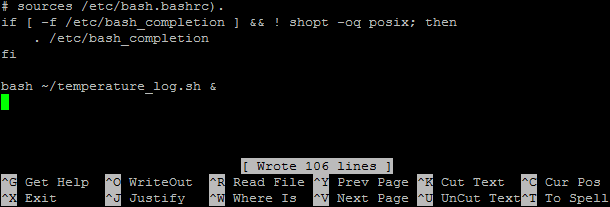
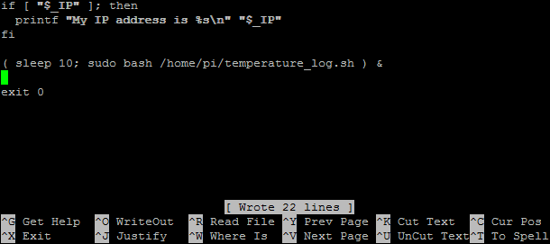

# Temperature Log

The BCM2835 system on a chip (SoC) of the Raspberry Pi has a temperature sensor that can be used to measure its temperature from the command line. It can provide information on how much heat the chip has generated during operation and also report on the temperature of the environment. This project's aim is to create a simple shell script that can run automatically as you boot up your Raspberry Pi, take measurements from the temperature sensor at given intervals, and write them into log files that can be viewed later.


Optionally, if you would like accurate timestamps for your temperature logs without network access, you will also need to set up a Real Time Clock. If you are using RasClock, for example, see [Afterthought Software - RasClock](http://afterthoughtsoftware.com/products/rasclock) for information on setting it up.


###LO1: Know what a shell script is and create one

## Creating a shell script to record the temperature

The chip's temperature can be read from the command line and can also be written into a file from there. A shell script, however, can run a sequence of commands and with a bash interpreter, which can be used to interpret a sequence or lines of text; it enables the repeated execution of this procedure.  The temperature can be continually read and recorded.  We will therefore use a shell script to record the temperature into a log file at set intervals.

### Viewing the temperature

To view the current temperature of your Raspberry Pi, you can just type the following into the command line: `/opt/vc/bin/vcgencmd measure_temp`.


### Creating a shell script

When writing a shell script, the first line contains information on what interpreter should be used to run the script. In this case we will use a bash script, since that the usage of loops which will be useful for our repeated measurements. To specify this, the first line of the script will be: `#!/bin/bash`.

To edit the script directly in the command line, you can use the built-in text editor, nano:

1. Type `nano temperature_log.sh` to create a file named `temperature_log.sh` and edit it. If the file already exists, nano will just let you edit it.
1. After that, you can move with the cursor and write into the file.
1. When you are finished editing the file, press `Ctrl` + `O` to attempt to save the file.
1. Press `Enter` to actually save the file (nano allows you to optionally change the file name before this).
1. Press `Ctrl` + `X` to exit nano.

*For more information on how to use the nano editor, please type `man nano` or see [nano's online documentation](http://www.nano-editor.org/dist/v2.2/nano.html).*

The following lines can contain a sequence of commands, so we can just write the command for viewing the temperature after the first line to test it:

```bash
#!/bin/bash

/opt/vc/bin/vcgencmd measure_temp
```

In order to be able to actually run the script, you will need to set the appropriates permission. To do this type `chmod +x temperature_log.sh` to give the file permission to be executed. After that, you can run the script by typing `./temperature_log.sh`, provided that the script is in the directory you are currently in. For example, if it is in your home directory, you can just type `~/temperature_log.sh` to run it from anywhere.

### Repeatedly viewing the temperature

In order to continuously record the temperature we need to use a loop in the shell script. There are two options: you can either create a loop that repeats indefinitely, or one that repeats a certain number of times, depending on what you would like to use it for. 

The example below will execute the code between `do` and `done` indefinitely:

```bash
while :
do
	/opt/vc/bin/vcgencmd measure_temp
done
```

Whereas this loop will repeatedly execute the code between `do` and `done` 30 times:

```bash
for i in {1..30}
do
	/opt/vc/bin/vcgencmd measure_temp
done
```

This code in the loop above now repeats the measurement, however, it does not pause or wait in-between the measurements; it takes the measurements immediately, one after the other. To only take measurements at specified intervals, we will need to wait a certain amount of time after each measurement. This can be done by inserting the line `sleep 10` just after the line for viewing the temperature; this will cause the script to wait for 10 seconds before it takes another reading.

#### Example script:

```bash
#!/bin/bash

while :
do
	/opt/vc/bin/vcgencmd measure_temp
	sleep 10
done
```

### Writing into a file

The `echo` command allows you to write content into the command line.  By setting a file as its output you can also write into text files. The following example first prints "test", then writes "test" into the file `test.txt`, finally displays the contents of `test.txt`:


In order to record multiple temperatures in a single file, we will need to append a new line to the file instead of rewriting it. This can be achieved by typing `echo test >>test.txt`.

### Creating a timestamp

When creating log files, it is a good idea to take a timestamp that will be included in the log file's name.  This can then be used to easily identify the different logs. If you don't have a Real Time Clock or network access the time will not be correct however, it will still maintain the log files in the correct order.

Type the command `date +%F_%H-%M-%S`, it will give you the current date and time as known to the Raspberry Pi in a format that is readable. This can be used as part of a filename and will also be correctly ordered. For example: `2014-07-30_10-59-56`. In this command, `%F` stands for the full date in a format such as `2014-07-30`, `%H` stands for the hour in the range `00..23`, `%M` stands for the minute in the range `00..59`, and `%S` stands for the second in the range `00..59`.

First, we will tell the interpreter to execute the `date` command, and then use the command's output by putting it between backticks: `` `date +%F_%H-%M-%S` ``. Then we can create a variable which we will call `timestamp`, and store the result in it: ``timestamp=`date +%F_%H-%M-%S` ``.

### Adding the timestamp to the log

At the beginning of the script we will create the log file, initialised with a small header line.

Type `echo "Temperature Log - $(date)" >/home/pi/logs/temperature_log_$timestamp.txt` to create a log file called `temperature_log_<timestamp>` in the directory `/home/pi/logs/`. *Note: we cannot reference the home directory as `~` if we choose to run the script before logging in. You will have to create the directory beforehand, for example with `mkdir ~/logs`*.

In the above command, `$(date)` returns the date in the default format and `$timestamp` returns the value of the variable called `timestamp`.

We can use a similar technique to store the temperature inside the loop in a variable, by writing ``temp=`/opt/vc/bin/vcgencmd measure_temp` ``. After that, optionally, we can get rid of the `temp=` part of the temperature measurement's result by typing `temp=${temp:5:16}`; this will take the variable's value, starting from the 5th character, for up to 16 characters. This value can then be appended to the file by writing: `echo $temp >>/home/pi/logs/temperature_log_$timestamp.txt`.

#### Example script:

```bash
#!/bin/bash

timestamp=`date +%F_%H-%M-%S`
echo "Temperature Log - $(date)" >/home/pi/logs/temperature_log_$timestamp.txt
while :
do
	temp=`/opt/vc/bin/vcgencmd measure_temp`
	temp=${temp:5:16}
	echo $temp >>/home/pi/logs/temperature_log_$timestamp.txt
	sleep 10
done
```

## Automate your shell script at startup

You may want your script to run automatically when you boot up your Raspberry Pi, this requires it to be run from one of the scripts that get executed at startup. You have two options: you can either add it to the `~/.bashrc` and then it will run when you log in, or you can add it to `/etc/rc.local` to make it run automatically while booting, before you have to log in. **Please be careful when editing those files (especially in the second case), as your Raspberry Pi will not boot up properly if the scripts are modified incorrectly!**

### Option 1: Run automatically when you log in using .bashrc

Type `nano ~/.bashrc` to open the file for editing (you can use any text editor you like), add the following line to the end of the file: `bash ~/temperature_log.sh &`. `bash` This will execute the shell script provided as its argument and the `&` character at the end ensures that the script will run in the background.



**Make sure not to miss the `&` character at the end, otherwise the script will not run in the background and will make the booting process get stuck in a loop!**

### Option 2: Run automatically while booting using rc.local

Type `sudo nano /etc/rc.local` to open the file for editing (you can use any text editor you like), and add the following line just before the `exit 0` at the end of the file: `( sleep 10; sudo bash /home/pi/temperature_log.sh ) &`. `bash` This will execute the shell script provided as its argument and the `&` character at the end ensures that the script will run in the background. The parentheses group the `sleep` and `bash` commands together, so that execution begins with a 10 second delay.



**Make sure not to miss the `&` character at the end, otherwise the script will not run in the background and will make the booting process get stuck in a loop!**

## Final shell script

Your final shell script should look something like this:

```bash
#!/bin/bash

timestamp=`date +%F_%H-%M-%S`
echo "Temperature Log - $(date)" >/home/pi/logs/temperature_log_$timestamp.txt
while :
do
	temp=`/opt/vc/bin/vcgencmd measure_temp`
	temp=${temp:5:16}
	echo $temp >>/home/pi/logs/temperature_log_$timestamp.txt
	sleep 10
done
```

## What next?

Try another shell script using the Raspberry Pi for temperature measurements in intervals of 5 minutes.

The example script below can be used to take a temperature measurement every 10 seconds for 5 minutes and then shut down, while also printing out information about the measurements:

```bash
#!/bin/bash

echo "Starting to record the temperature" 
timestamp=`date +%F_%H-%M-%S`
echo "Writing into /home/pi/logs/temperature_log_$timestamp.txt" 
echo "Temperature Log - $(date)" >/home/pi/logs/temperature_log_$timestamp.txt
for i in {1..30}
do
	temp=`/opt/vc/bin/vcgencmd measure_temp`
	temp=${temp:5:16}
	echo $temp >>/home/pi/logs/temperature_log_$timestamp.txt
	echo "Recorded temperature #$i:"
	tail -1 /home/pi/logs/temperature_log_$timestamp.txt
	sleep 10
done
echo "Finished recording the temperature, shutting down"
sudo shutdown -h now
```
